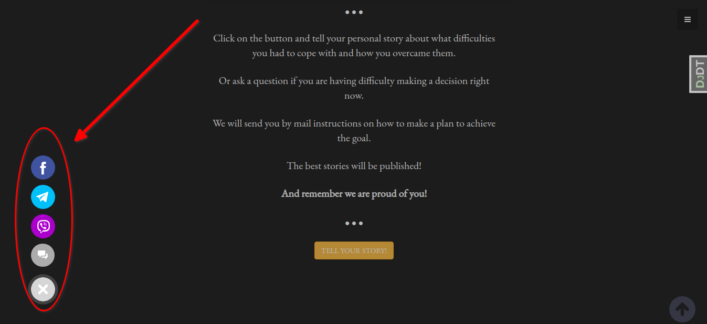
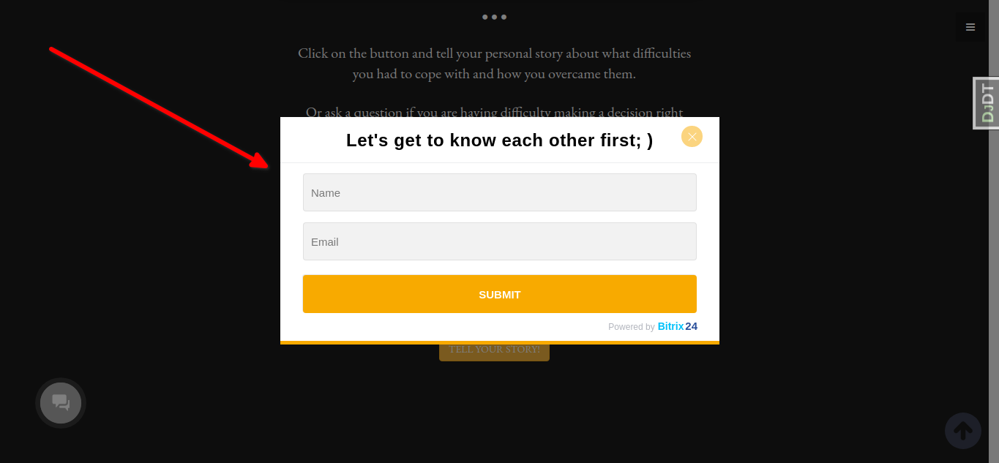
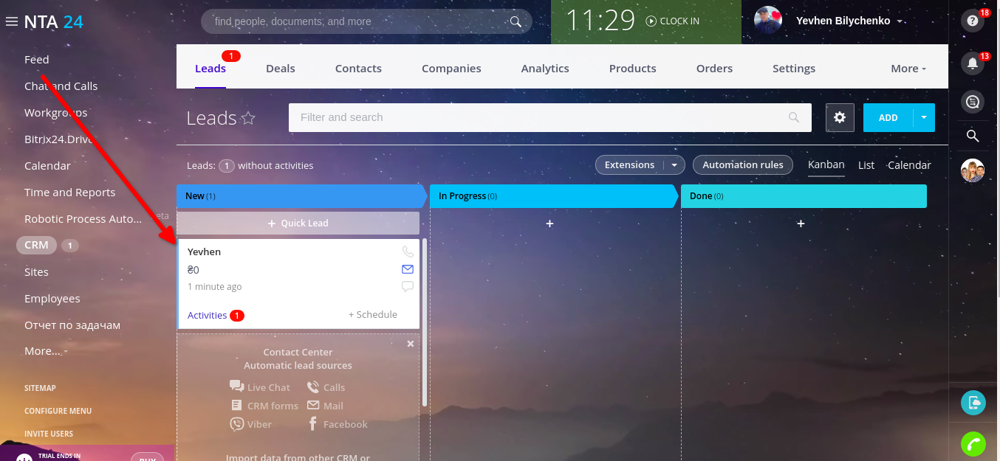
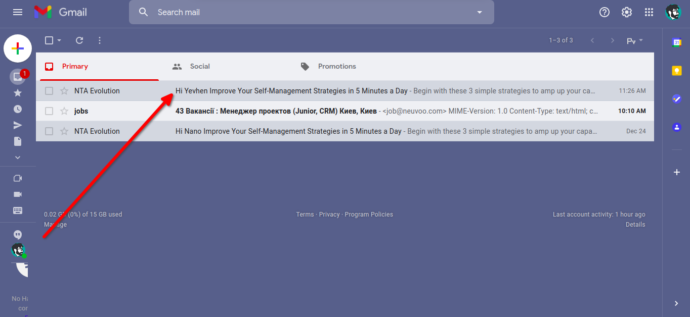
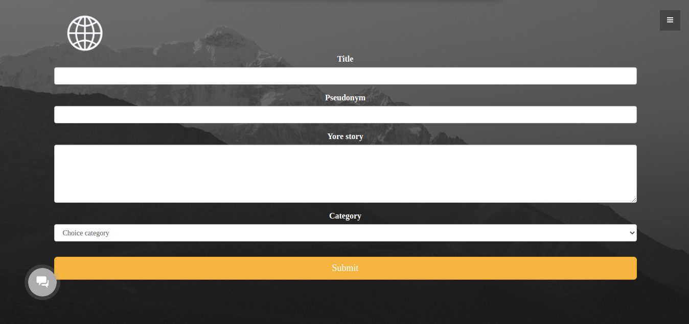
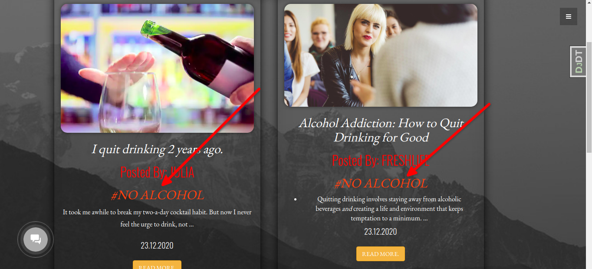
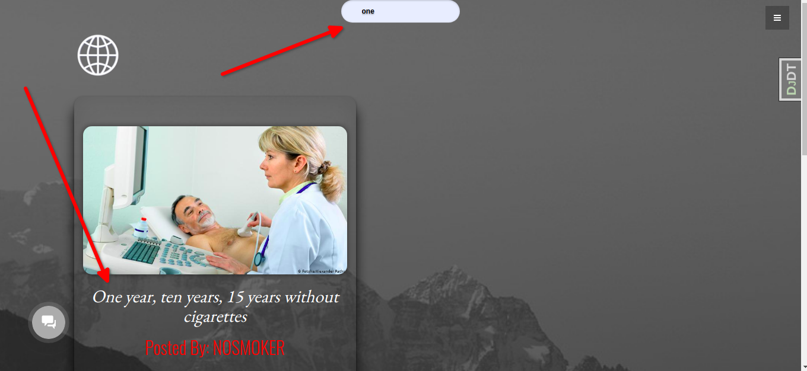
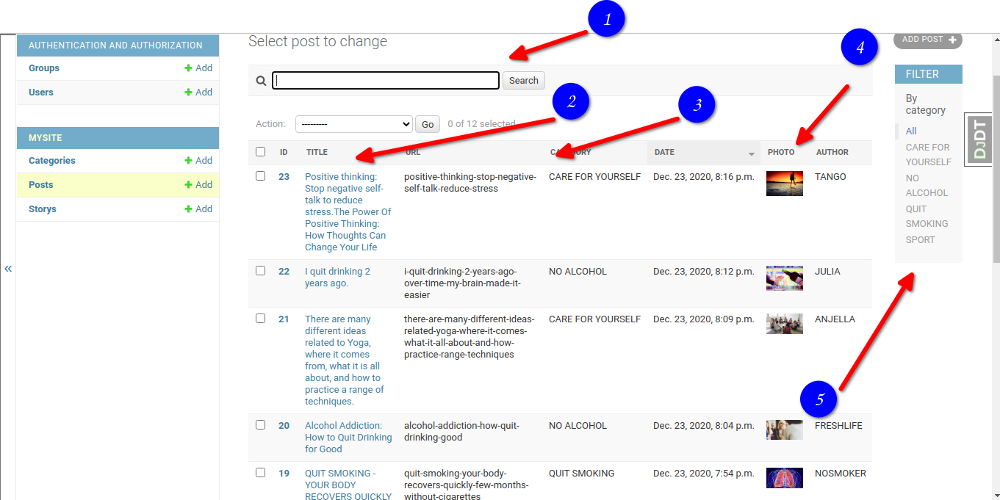
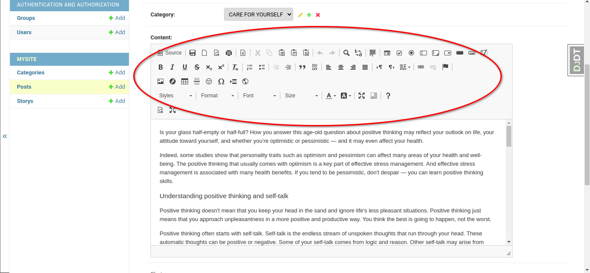
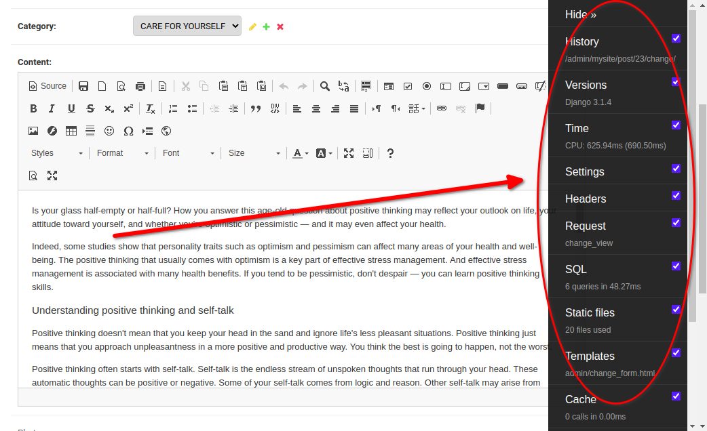

# Final project for [CS50's Web Programming with Python and JavaScript](https://www.edx.org/course/cs50s-web-programming-with-python-and-javascript)

# The name of the project: "Believe in yourself"

# Mission of the project:
## Help and support people who have decided to change their lifestyle and profession or want to make such a decision.

# Features of the project:

## Integration with CRM system Bitrix 24. Automation of work with requests.

# Author's motivation : 
> I have smoked for 15 years and have tried many times to overcome this bad habit. I was constantly looking for support on forums, social media and videos. When I read stories of people who quit smoking, I followed their advice. After three months of searching for information, I found my own way to quit smoking and manage my lifestyle. And I decided to make a project that will contain information in one place video, posts, real stories, support in real time.I have not smoked for three years and I hope that this project will be useful for those who want to get rid of bad habits and change their lives.

# Overview :

## Online chat

Online chat Bitrix 24 is connected to the project, which allows the user with the operator online. Also, Facebook, Telegram, Viber are connected to the online chat for the convenience of communication.

## Let's get to know each other
After filling out the form related to Bitrix24 

Lead is created in the CRM system

And the user is automatically sent a letter to the mail with instructions on how to manage life)

## Add story 

Then the user is automatically redirected to the add story page. Here the user can write about their achievements, plans, dreams.

## All stories

On the page all stories, you can read the best case studies on the topic of the project published by the content manager.
Here the user can sort stories by tag.

And also use the search by name

## For content manager
A convenient panel for managing posts has been created
1. Search
2. Post title
3. Brief description
4. Preview picture
5. Filter by category

Also added a convenient content editor [CKEditor 5](https://ckeditor.com/ )

## For technical support

For technical support, performance monitoring and project scaling installed [ Django Debug Toolbar](https://django-debug-toolbar.readthedocs.io/en/latest/changes.html)

